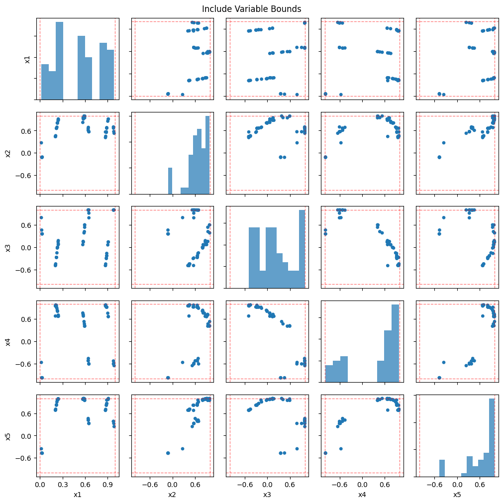
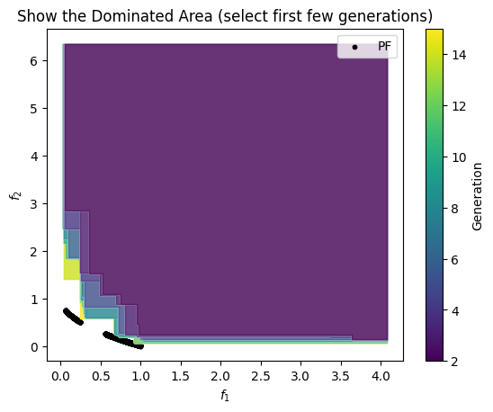
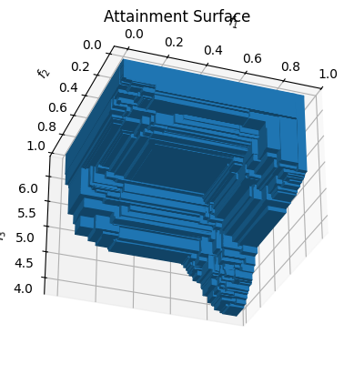
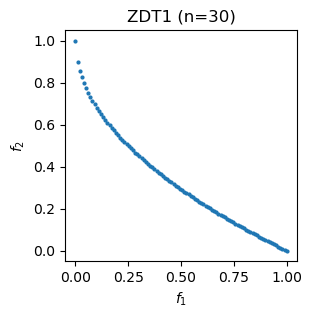
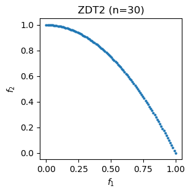
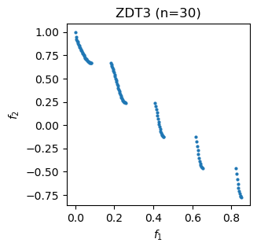
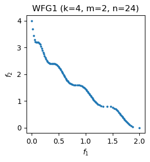
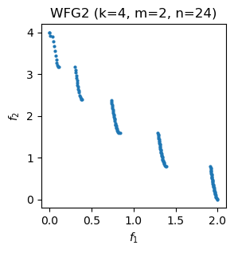
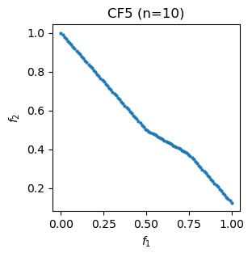

# ParetoBench

[](https://pypi.org/pypi/paretobench/)
[](https://anaconda.org/channels/conda-forge/packages/paretobench/overview)
[](https://pypi.org/pypi/paretobench/)
[](https://pypi.org/pypi/paretobench/)

ParetoBench is a Python library that provides a collection of tools for the benchmarking of multi-objective optimization algorithms. It includes the following.

- Multi-objective benchmark problems including analytical Pareto fronts when available
- Container objects for storing and manipulating data from optimization algorithms
- A standardized file format for saving the results of optimizations on benchmark problems
- Tools for calculating convergence metrics on results and running statistical analyses on them to compare algorithms
- Plotting utilities for objectives/decision variables and for both populations and series of populations (history objects)

## Installation

ParetoBench is available from pip and conda.

```bash
pip install paretobench
```

or

```bash
conda install paretobench
```

## Containers and File Format

Objects and a file format for storing data from multi-objective optimization algorithms are included in the package.

- `Population` - The atomic class of the library. Represents a single generation in a genetic algorithm complete with variables (`x`), objectives (`f`), and constraints (`g`).
- `History` - A collection of populations representing the history of one run of a genetic algorithm.
- `Experiment` - A benchmarking experiment with multiple histories representing multiple evaluations of a genetic algorithm, potentially on multiple problems as is used in benchmarking.

The `Experiment` objects may be saved to a standardized HDF5-backed format for long-term storage and interchange between codes.

Learn more about the containers in the [container objects example](container_objects.ipynb).

## Plotting

Tools for plotting the data from multi-objective optimization algorithms are also included.

- Pairwise decision variables plots for `Population` and `History` objects
    - Variable boundaries
    - Color coding or animation for showing multiple populations
    - Markers and alpha to distinguish non-dominated / infeasible solutions
- Objective scatter plots for `Population` and `History` objects
    - Analytical Pareto fronts for library problems
    - Attainment surfaces in 2D and 3D
    - Color coding or animation for showing multiple populations
    - Markers and alpha to distinguish non-dominated / infeasible solutions

See more information in the following notebooks.

- [Plotting populations](plotting/plotting_populations.ipynb)
- [Plotting histories](plotting/plotting_histories.ipynb)

<table>
<tr>
<td></td>
<td></td>
<td></td>
</tr>
</table>

## Benchmark Problems

| Problem | Objectives | Variables | Constraints | PF | Description |
|---------|:---:|:---:|:---:|:---:|---|
| ZDT[1-3] | 2 | ≥2 | 0 | Y | Classic 2-objective suite; convex, non-convex, and disconnected fronts |
| ZDT4 | 2 | 10 | 0 | Y | Many local Pareto fronts |
| ZDT6 | 2 | 10 | 0 | Y | Non-uniform spacing along front |
| DTLZ[1-7] | ≥2 | ≥m | 0 | Y | Scalable suite with varied front geometry and difficulty |
| DTLZ[8-9] | ≥2 | ≥m | ≥1 | Y | Scalable constrained problems |
| WFG[1-9] | ≥2 | ≥2m | 0 | Y | Scalable suite with diverse transformations and front shapes |
| CF[1-7] | 2 | ≥2 | 1-2 | Y | CEC 2009 constrained 2-objective problems |
| CF[8-10] | 3 | ≥3 | 1 | Y | CEC 2009 constrained 3-objective problems |
| CTP[1-7] | 2 | ≥2 | ≥1 | - | Constrained problems with varied feasible regions |
| SCH | 2 | 1 | 0 | - | Schaffer's function |
| FON | 2 | 3 | 0 | - | Fonseca-Fleming function |
| POL | 2 | 2 | 0 | - | Poloni's two-objective function |
| KUR | 2 | ≥2 | 0 | - | Kursawe's function |
| CONSTR | 2 | 2 | 2 | - | Simple constrained 2-objective problem |
| SRN | 2 | 2 | 2 | - | Srinivas-Deb constrained problem |
| TNK | 2 | 2 | 2 | - | Tanaka constrained problem |
| WATER | 5 | 3 | 7 | - | Water resource management problem |

### Analytical Pareto Fronts

When possible, the benchmark problems include analytical Pareto fronts.

<table>
<tr>
<td></td>
<td></td>
<td></td>
</tr>
<tr>
<td></td>
<td></td>
<td></td>
</tr>
</table>

## Parameter Naming Conventions

To help standardize the code in this package, the following naming convention is used throughout for parameters.

Some names are reserved for specific purposes. These are the following.

- `n`: The dimension of the input vector to the problem, ie the number of decision variables.
- `m`: The number of objectives.

All parameters should follow the PEP 8 naming scheme for variables. Whenever this leads to a parameter being named something different than what it was called in the problem's defining paper, this change must be documented in the class.
